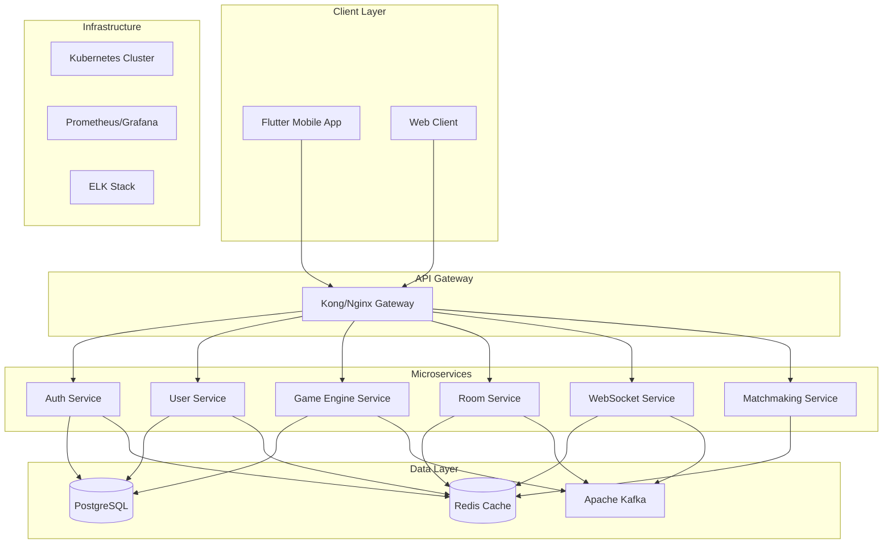
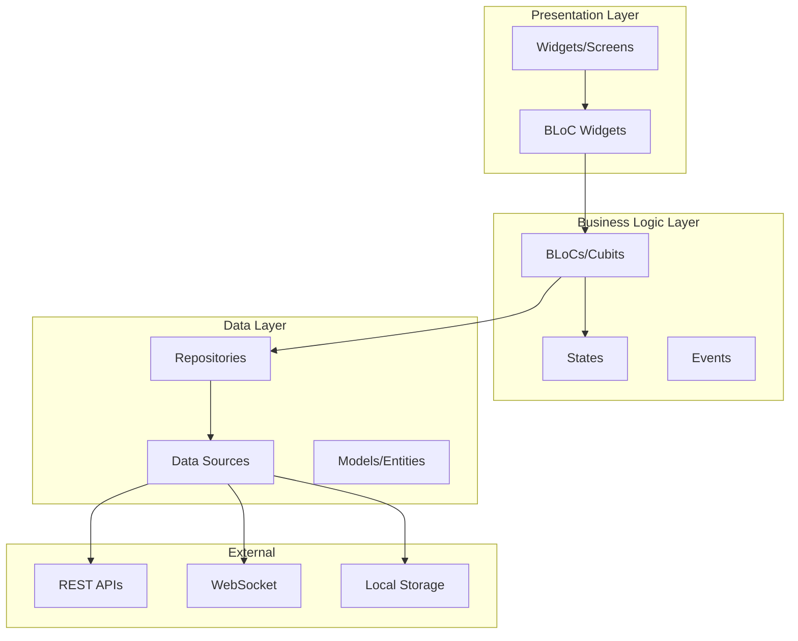

# Design Document

## Overview

The Chinese Bridge game platform is designed as a cloud-native microservices architecture built with Go backend services, Flutter mobile frontend, and deployed on Kubernetes. The system implements a sophisticated card game engine that handles complex rule validation, real-time multiplayer communication, and scalable user management. The architecture follows Domain-Driven Design principles with clear service boundaries and emphasizes fault tolerance, observability, and performance.

## Architecture

### High-Level Architecture



### Service Architecture Pattern

The system follows the **Hexagonal Architecture** (Ports and Adapters) pattern within each microservice:

- **Domain Layer**: Core business logic and entities
- **Application Layer**: Use cases and orchestration
- **Infrastructure Layer**: External dependencies (database, cache, messaging)
- **Interface Layer**: HTTP handlers, gRPC servers, WebSocket handlers

## Components and Interfaces

### 1. Authentication Service

**Responsibility**: Handle user authentication, authorization, and JWT token management.

**Key Components**:

- OAuth2 integration with Google
- JWT token generation and validation
- User session management
- Rate limiting and security policies

**API Endpoints**:

```go
// Swagger annotations for auto-documentation
// @Summary Google OAuth login
// @Description Authenticate user with Google OAuth2
// @Tags authentication
// @Accept json
// @Produce json
// @Param code query string true "OAuth authorization code"
// @Success 200 {object} AuthResponse
// @Router /auth/google [post]
POST /auth/google

// @Summary Refresh JWT token
// @Description Refresh expired JWT token
// @Tags authentication
// @Security BearerAuth
// @Success 200 {object} TokenResponse
// @Router /auth/refresh [post]
POST /auth/refresh

// @Summary Logout user
// @Description Invalidate user session
// @Tags authentication
// @Security BearerAuth
// @Success 200 {object} MessageResponse
// @Router /auth/logout [post]
POST /auth/logout
```

**Data Models**:

```go
type User struct {
    ID        string    `json:"id" gorm:"type:uuid;primary_key;default:gen_random_uuid()"`
    GoogleID  string    `json:"google_id" gorm:"uniqueIndex;not null"`
    Email     string    `json:"email" gorm:"uniqueIndex;not null"`
    Name      string    `json:"name" gorm:"not null"`
    Avatar    string    `json:"avatar"`
    CreatedAt time.Time `json:"created_at" gorm:"autoCreateTime"`
    UpdatedAt time.Time `json:"updated_at" gorm:"autoUpdateTime"`
}

type Session struct {
    ID        string    `json:"id" gorm:"type:uuid;primary_key;default:gen_random_uuid()"`
    UserID    string    `json:"user_id" gorm:"type:uuid;not null;index"`
    Token     string    `json:"token" gorm:"not null;index"`
    ExpiresAt time.Time `json:"expires_at" gorm:"not null"`
    CreatedAt time.Time `json:"created_at" gorm:"autoCreateTime"`
    User      User      `json:"user" gorm:"foreignKey:UserID"`
}
```

### 2. User Service

**Responsibility**: Manage user profiles, statistics, and game history.

**Key Components**:

- User profile management
- Game statistics tracking
- Friend system (future enhancement)
- Leaderboards

**API Endpoints**:

```go
// @Summary Get user profile
// @Description Retrieve user profile information
// @Tags users
// @Security BearerAuth
// @Success 200 {object} UserProfile
// @Router /users/profile [get]
GET /users/profile

// @Summary Update user profile
// @Description Update user profile information
// @Tags users
// @Security BearerAuth
// @Param profile body UserUpdateRequest true "Profile update data"
// @Success 200 {object} UserProfile
// @Router /users/profile [put]
PUT /users/profile

// @Summary Get user statistics
// @Description Retrieve user game statistics
// @Tags users
// @Security BearerAuth
// @Success 200 {object} UserStats
// @Router /users/stats [get]
GET /users/stats

// @Summary Get game history
// @Description Retrieve user's game history
// @Tags users
// @Security BearerAuth
// @Param page query int false "Page number"
// @Param limit query int false "Items per page"
// @Success 200 {object} GameHistoryResponse
// @Router /users/history [get]
GET /users/history
```

### 3. Room Service

**Responsibility**: Manage game rooms, player joining/leaving, and room state.

**Key Components**:

- Room creation and management
- Player capacity management (4 players)
- Room state synchronization
- Lobby management

**API Endpoints**:

```go
// @Summary Create game room
// @Description Create a new game room
// @Tags rooms
// @Security BearerAuth
// @Param room body CreateRoomRequest true "Room creation data"
// @Success 201 {object} Room
// @Router /rooms [post]
POST /rooms

// @Summary Join game room
// @Description Join an existing game room
// @Tags rooms
// @Security BearerAuth
// @Param roomId path string true "Room ID"
// @Success 200 {object} Room
// @Router /rooms/{roomId}/join [post]
POST /rooms/{roomId}/join

// @Summary Leave game room
// @Description Leave current game room
// @Tags rooms
// @Security BearerAuth
// @Param roomId path string true "Room ID"
// @Success 200 {object} MessageResponse
// @Router /rooms/{roomId}/leave [post]
POST /rooms/{roomId}/leave

// @Summary Get room details
// @Description Get current room information
// @Tags rooms
// @Security BearerAuth
// @Param roomId path string true "Room ID"
// @Success 200 {object} Room
// @Router /rooms/{roomId} [get]
GET /rooms/{roomId}
```

### 4. Game Engine Service

**Responsibility**: Core Chinese Bridge game logic, rule validation, and game state management.

**Key Components**:

- Card deck management (108 cards)
- Bidding phase logic
- Trump suit and card hierarchy
- Trick-taking validation
- Formation recognition (singles, pairs, tractors)
- Scoring calculation

**Core Game Entities**:

```go
type Card struct {
    Suit     Suit     `json:"suit"`
    Rank     Rank     `json:"rank"`
    DeckID   int      `json:"deck_id"` // 1 or 2 for duplicate cards
    IsJoker  bool     `json:"is_joker"`
    JokerType JokerType `json:"joker_type,omitempty"`
}

type GameState struct {
    ID           string           `json:"id"`
    RoomID       string           `json:"room_id"`
    Phase        GamePhase        `json:"phase"`
    Players      [4]Player        `json:"players"`
    Declarer     *string          `json:"declarer,omitempty"`
    TrumpSuit    *Suit            `json:"trump_suit,omitempty"`
    Contract     int              `json:"contract"`
    CurrentTrick Trick            `json:"current_trick"`
    Tricks       []Trick          `json:"tricks"`
    Kitty        []Card           `json:"kitty"`
    Scores       map[string]int   `json:"scores"`
    CreatedAt    time.Time        `json:"created_at"`
    UpdatedAt    time.Time        `json:"updated_at"`
}

type Formation struct {
    Type  FormationType `json:"type"`  // Single, Pair, Tractor
    Cards []Card        `json:"cards"`
    Suit  Suit          `json:"suit"`
}

type Trick struct {
    ID       string                `json:"id"`
    Leader   string                `json:"leader"`
    Plays    map[string]Formation  `json:"plays"`
    Winner   string                `json:"winner"`
    Points   int                   `json:"points"`
}
```

**Game Logic APIs**:

```go
// @Summary Start new game
// @Description Initialize a new Chinese Bridge game
// @Tags game
// @Security BearerAuth
// @Param roomId path string true "Room ID"
// @Success 200 {object} GameState
// @Router /game/{roomId}/start [post]
POST /game/{roomId}/start

// @Summary Make bid
// @Description Place a bid during bidding phase
// @Tags game
// @Security BearerAuth
// @Param gameId path string true "Game ID"
// @Param bid body BidRequest true "Bid information"
// @Success 200 {object} GameState
// @Router /game/{gameId}/bid [post]
POST /game/{gameId}/bid

// @Summary Declare trump
// @Description Declare trump suit as Declarer
// @Tags game
// @Security BearerAuth
// @Param gameId path string true "Game ID"
// @Param trump body TrumpRequest true "Trump suit"
// @Success 200 {object} GameState
// @Router /game/{gameId}/trump [post]
POST /game/{gameId}/trump

// @Summary Exchange kitty
// @Description Exchange cards with kitty as Declarer
// @Tags game
// @Security BearerAuth
// @Param gameId path string true "Game ID"
// @Param exchange body KittyExchangeRequest true "Cards to exchange"
// @Success 200 {object} GameState
// @Router /game/{gameId}/kitty [post]
POST /game/{gameId}/kitty

// @Summary Play cards
// @Description Play a formation of cards
// @Tags game
// @Security BearerAuth
// @Param gameId path string true "Game ID"
// @Param play body PlayRequest true "Cards to play"
// @Success 200 {object} GameState
// @Router /game/{gameId}/play [post]
POST /game/{gameId}/play
```

### 5. WebSocket Service

**Responsibility**: Real-time communication for live game updates and player interactions.

**Key Components**:

- WebSocket connection management
- Real-time game state broadcasting
- Player action notifications
- Connection recovery and reconnection

**WebSocket Events**:

```go
type WSMessage struct {
    Type    string      `json:"type"`
    GameID  string      `json:"game_id,omitempty"`
    RoomID  string      `json:"room_id,omitempty"`
    UserID  string      `json:"user_id"`
    Payload interface{} `json:"payload"`
}

// Event types
const (
    EventPlayerJoined    = "player_joined"
    EventPlayerLeft      = "player_left"
    EventGameStarted     = "game_started"
    EventBidMade         = "bid_made"
    EventTrumpDeclared   = "trump_declared"
    EventCardsPlayed     = "cards_played"
    EventTrickWon        = "trick_won"
    EventGameEnded       = "game_ended"
    EventPlayerReconnect = "player_reconnect"
)
```

### 7. Kafka Messaging System

**Responsibility**: Asynchronous communication between microservices for event-driven architecture.

**Key Components**:

- Event publishing and consumption
- Message ordering and partitioning
- Dead letter queue handling
- Schema registry for message validation

**Kafka Topics**:

```go
const (
    TopicGameEvents    = "game-events"
    TopicRoomEvents    = "room-events"
    TopicUserEvents    = "user-events"
    TopicNotifications = "notifications"
)

// Kafka message structure
type KafkaMessage struct {
    ID        string                 `json:"id"`
    Type      string                 `json:"type"`
    Source    string                 `json:"source"`
    Timestamp time.Time              `json:"timestamp"`
    Data      map[string]interface{} `json:"data"`
    Metadata  map[string]string      `json:"metadata"`
}

// Game event types
type GameEvent struct {
    GameID    string      `json:"game_id"`
    RoomID    string      `json:"room_id"`
    PlayerID  string      `json:"player_id"`
    EventType string      `json:"event_type"`
    Payload   interface{} `json:"payload"`
    Timestamp time.Time   `json:"timestamp"`
}
```

**Kafka Producer/Consumer Implementation**:

```go
type KafkaProducer interface {
    PublishGameEvent(ctx context.Context, event GameEvent) error
    PublishRoomEvent(ctx context.Context, event RoomEvent) error
    PublishUserEvent(ctx context.Context, event UserEvent) error
}

type KafkaConsumer interface {
    ConsumeGameEvents(ctx context.Context, handler GameEventHandler) error
    ConsumeRoomEvents(ctx context.Context, handler RoomEventHandler) error
    ConsumeUserEvents(ctx context.Context, handler UserEventHandler) error
}
```

### 6. Matchmaking Service

**Responsibility**: Match players for games and manage game queues.

**Key Components**:

- Player queue management
- Skill-based matching (future enhancement)
- Room assignment
- Queue timeout handling

## Data Models

### Database Models (GORM)

```go
// User model with GORM tags
type User struct {
    ID        string    `json:"id" gorm:"type:uuid;primary_key;default:gen_random_uuid()"`
    GoogleID  string    `json:"google_id" gorm:"uniqueIndex;not null"`
    Email     string    `json:"email" gorm:"uniqueIndex;not null"`
    Name      string    `json:"name" gorm:"not null"`
    Avatar    string    `json:"avatar"`
    CreatedAt time.Time `json:"created_at" gorm:"autoCreateTime"`
    UpdatedAt time.Time `json:"updated_at" gorm:"autoUpdateTime"`

    // Associations
    Stats             UserStats           `json:"stats,omitempty" gorm:"foreignKey:UserID"`
    HostedRooms       []Room             `json:"hosted_rooms,omitempty" gorm:"foreignKey:HostID"`
    RoomParticipants  []RoomParticipant  `json:"room_participants,omitempty" gorm:"foreignKey:UserID"`
    GameParticipants  []GameParticipant  `json:"game_participants,omitempty" gorm:"foreignKey:UserID"`
}

// User statistics model
type UserStats struct {
    UserID          string  `json:"user_id" gorm:"type:uuid;primary_key"`
    GamesPlayed     int     `json:"games_played" gorm:"default:0"`
    GamesWon        int     `json:"games_won" gorm:"default:0"`
    GamesAsDeclarer int     `json:"games_as_declarer" gorm:"default:0"`
    DeclarerWins    int     `json:"declarer_wins" gorm:"default:0"`
    TotalPoints     int     `json:"total_points" gorm:"default:0"`
    AverageBid      float64 `json:"average_bid" gorm:"type:decimal(5,2);default:0"`
    CreatedAt       time.Time `json:"created_at" gorm:"autoCreateTime"`
    UpdatedAt       time.Time `json:"updated_at" gorm:"autoUpdateTime"`

    // Association
    User User `json:"user" gorm:"foreignKey:UserID"`
}

// Room model
type Room struct {
    ID             string    `json:"id" gorm:"type:uuid;primary_key;default:gen_random_uuid()"`
    Name           string    `json:"name" gorm:"not null"`
    HostID         string    `json:"host_id" gorm:"type:uuid;not null"`
    MaxPlayers     int       `json:"max_players" gorm:"default:4"`
    CurrentPlayers int       `json:"current_players" gorm:"default:0"`
    Status         string    `json:"status" gorm:"default:'waiting'"`
    CreatedAt      time.Time `json:"created_at" gorm:"autoCreateTime"`
    UpdatedAt      time.Time `json:"updated_at" gorm:"autoUpdateTime"`

    // Associations
    Host         User               `json:"host" gorm:"foreignKey:HostID"`
    Participants []RoomParticipant  `json:"participants" gorm:"foreignKey:RoomID"`
    Games        []Game             `json:"games,omitempty" gorm:"foreignKey:RoomID"`
}

// Room participants junction table
type RoomParticipant struct {
    RoomID   string    `json:"room_id" gorm:"type:uuid;primaryKey"`
    UserID   string    `json:"user_id" gorm:"type:uuid;primaryKey"`
    Position int       `json:"position"` // 0-3 for seating position
    JoinedAt time.Time `json:"joined_at" gorm:"autoCreateTime"`

    // Associations
    Room Room `json:"room" gorm:"foreignKey:RoomID"`
    User User `json:"user" gorm:"foreignKey:UserID"`
}

// Game model
type Game struct {
    ID          string     `json:"id" gorm:"type:uuid;primary_key;default:gen_random_uuid()"`
    RoomID      string     `json:"room_id" gorm:"type:uuid;not null"`
    DeclarerID  *string    `json:"declarer_id" gorm:"type:uuid"`
    TrumpSuit   *string    `json:"trump_suit"`
    Contract    int        `json:"contract"`
    FinalScore  int        `json:"final_score"`
    WinnerTeam  *string    `json:"winner_team"` // 'declarer' or 'defenders'
    GameData    datatypes.JSON `json:"game_data" gorm:"type:jsonb"` // Complete game state
    StartedAt   *time.Time `json:"started_at"`
    EndedAt     *time.Time `json:"ended_at"`
    CreatedAt   time.Time  `json:"created_at" gorm:"autoCreateTime"`

    // Associations
    Room         Room               `json:"room" gorm:"foreignKey:RoomID"`
    Declarer     *User              `json:"declarer,omitempty" gorm:"foreignKey:DeclarerID"`
    Participants []GameParticipant  `json:"participants" gorm:"foreignKey:GameID"`
}

// Game participants junction table
type GameParticipant struct {
    GameID         string `json:"game_id" gorm:"type:uuid;primaryKey"`
    UserID         string `json:"user_id" gorm:"type:uuid;primaryKey"`
    Position       int    `json:"position"` // 0-3 for game position
    Role           string `json:"role"`     // 'declarer' or 'defender'
    PointsCaptured int    `json:"points_captured" gorm:"default:0"`

    // Associations
    Game Game `json:"game" gorm:"foreignKey:GameID"`
    User User `json:"user" gorm:"foreignKey:UserID"`
}

// GORM repository interface
type Repository interface {
    // User operations
    CreateUser(ctx context.Context, user *User) error
    GetUserByID(ctx context.Context, id string) (*User, error)
    GetUserByGoogleID(ctx context.Context, googleID string) (*User, error)
    UpdateUser(ctx context.Context, user *User) error

    // Room operations
    CreateRoom(ctx context.Context, room *Room) error
    GetRoomByID(ctx context.Context, id string) (*Room, error)
    UpdateRoom(ctx context.Context, room *Room) error
    AddRoomParticipant(ctx context.Context, participant *RoomParticipant) error
    RemoveRoomParticipant(ctx context.Context, roomID, userID string) error

    // Game operations
    CreateGame(ctx context.Context, game *Game) error
    GetGameByID(ctx context.Context, id string) (*Game, error)
    UpdateGame(ctx context.Context, game *Game) error
    GetUserGameHistory(ctx context.Context, userID string, limit, offset int) ([]Game, error)

    // Statistics operations
    UpdateUserStats(ctx context.Context, stats *UserStats) error
    GetLeaderboard(ctx context.Context, limit int) ([]UserStats, error)
}

// GORM implementation example
type gormRepository struct {
    db *gorm.DB
}

func (r *gormRepository) CreateUser(ctx context.Context, user *User) error {
    return r.db.WithContext(ctx).Create(user).Error
}

func (r *gormRepository) GetUserByID(ctx context.Context, id string) (*User, error) {
    var user User
    err := r.db.WithContext(ctx).
        Preload("Stats").
        First(&user, "id = ?", id).Error
    if err != nil {
        return nil, err
    }
    return &user, nil
}

func (r *gormRepository) GetRoomByID(ctx context.Context, id string) (*Room, error) {
    var room Room
    err := r.db.WithContext(ctx).
        Preload("Host").
        Preload("Participants").
        Preload("Participants.User").
        First(&room, "id = ?", id).Error
    if err != nil {
        return nil, err
    }
    return &room, nil
}
```

### Redis Cache Structure

```go
// Cache keys and structures
const (
    // User session cache
    UserSessionKey = "session:%s" // session:user_id

    // Room state cache
    RoomStateKey = "room:%s" // room:room_id

    // Active game state cache
    GameStateKey = "game:%s" // game:game_id

    // Player queue for matchmaking
    MatchmakingQueueKey = "queue:matchmaking"

    // Leaderboard cache
    LeaderboardKey = "leaderboard:global"

    // WebSocket connection mapping
    WSConnectionKey = "ws:user:%s" // ws:user:user_id
)

// Cached data structures
type CachedRoomState struct {
    ID           string    `json:"id"`
    Name         string    `json:"name"`
    HostID       string    `json:"host_id"`
    Players      []string  `json:"players"`
    Status       string    `json:"status"`
    UpdatedAt    time.Time `json:"updated_at"`
    TTL          int       `json:"ttl"` // 30 minutes
}

type CachedGameState struct {
    GameState    GameState `json:"game_state"`
    LastActivity time.Time `json:"last_activity"`
    TTL          int       `json:"ttl"` // 2 hours
}
```

## Error Handling

### Error Response Structure

```go
type ErrorResponse struct {
    Code    string `json:"code"`
    Message string `json:"message"`
    Details string `json:"details,omitempty"`
    TraceID string `json:"trace_id"`
}

// Standard error codes
const (
    ErrCodeValidation     = "VALIDATION_ERROR"
    ErrCodeAuthentication = "AUTHENTICATION_ERROR"
    ErrCodeAuthorization  = "AUTHORIZATION_ERROR"
    ErrCodeNotFound       = "NOT_FOUND"
    ErrCodeConflict       = "CONFLICT"
    ErrCodeGameRule       = "GAME_RULE_VIOLATION"
    ErrCodeInternalError  = "INTERNAL_ERROR"
    ErrCodeServiceUnavailable = "SERVICE_UNAVAILABLE"
)
```

### Circuit Breaker Implementation

```go
type CircuitBreaker struct {
    maxFailures int
    timeout     time.Duration
    state       CircuitState
    failures    int
    lastFailure time.Time
    mutex       sync.RWMutex
}

// Circuit breaker states
type CircuitState int
const (
    StateClosed CircuitState = iota
    StateOpen
    StateHalfOpen
)
```

## Testing Strategy

### Unit Testing

- **Coverage Target**: 80% minimum
- **Framework**: Go's built-in testing package with testify for assertions
- **Mocking**: gomock for interface mocking
- **Test Structure**: Table-driven tests for comprehensive coverage

### Integration Testing

- **Database Testing**: Use testcontainers for PostgreSQL and Redis with GORM migrations
- **API Testing**: HTTP client tests against running services
- **Kafka Testing**: Test async communication patterns with embedded Kafka
- **ORM Testing**: Test GORM models and relationships with in-memory SQLite

### End-to-End Testing

- **Game Flow Testing**: Complete game scenarios from room creation to game completion
- **WebSocket Testing**: Real-time communication validation
- **Load Testing**: Concurrent game simulation

### Performance Testing

- **Load Testing**: Artillery.js or k6 for API load testing
- **Stress Testing**: Simulate 1000+ concurrent games
- **Memory Profiling**: Go's pprof for memory leak detection

```go
// Example unit test structure
func TestGameEngine_ValidateBid(t *testing.T) {
    tests := []struct {
        name        string
        currentBid  int
        newBid      int
        expectError bool
        errorCode   string
    }{
        {
            name:        "valid_bid_decrease",
            currentBid:  125,
            newBid:      120,
            expectError: false,
        },
        {
            name:        "invalid_bid_increase",
            currentBid:  120,
            newBid:      125,
            expectError: true,
            errorCode:   ErrCodeGameRule,
        },
        // More test cases...
    }

    for _, tt := range tests {
        t.Run(tt.name, func(t *testing.T) {
            engine := NewGameEngine()
            err := engine.ValidateBid(tt.currentBid, tt.newBid)

            if tt.expectError {
                assert.Error(t, err)
                assert.Contains(t, err.Error(), tt.errorCode)
            } else {
                assert.NoError(t, err)
            }
        })
    }
}
```

## Flutter Frontend Architecture

### Frontend Architecture Pattern

The Flutter frontend follows **Clean Architecture** principles with **BLoC (Business Logic Component)** pattern for state management, ensuring separation of concerns and testability.



### Project Structure

```
lib/
├── core/
│   ├── constants/
│   ├── errors/
│   ├── network/
│   ├── utils/
│   └── widgets/
├── features/
│   ├── authentication/
│   │   ├── data/
│   │   │   ├── datasources/
│   │   │   ├── models/
│   │   │   └── repositories/
│   │   ├── domain/
│   │   │   ├── entities/
│   │   │   ├── repositories/
│   │   │   └── usecases/
│   │   └── presentation/
│   │       ├── bloc/
│   │       ├── pages/
│   │       └── widgets/
│   ├── game/
│   │   ├── data/
│   │   ├── domain/
│   │   └── presentation/
│   ├── room/
│   │   ├── data/
│   │   ├── domain/
│   │   └── presentation/
│   └── user/
│       ├── data/
│       ├── domain/
│       └── presentation/
├── injection_container.dart
└── main.dart
```

### State Management with BLoC

**Authentication BLoC**:

```dart
// Authentication Events
abstract class AuthEvent extends Equatable {
  const AuthEvent();

  @override
  List<Object> get props => [];
}

class GoogleSignInRequested extends AuthEvent {}

class SignOutRequested extends AuthEvent {}

class AuthStatusChanged extends AuthEvent {
  final AuthStatus status;

  const AuthStatusChanged(this.status);

  @override
  List<Object> get props => [status];
}

// Authentication States
abstract class AuthState extends Equatable {
  const AuthState();

  @override
  List<Object> get props => [];
}

class AuthInitial extends AuthState {}

class AuthLoading extends AuthState {}

class AuthAuthenticated extends AuthState {
  final User user;

  const AuthAuthenticated(this.user);

  @override
  List<Object> get props => [user];
}

class AuthUnauthenticated extends AuthState {}

class AuthError extends AuthState {
  final String message;

  const AuthError(this.message);

  @override
  List<Object> get props => [message];
}

// Authentication BLoC
class AuthBloc extends Bloc<AuthEvent, AuthState> {
  final AuthRepository _authRepository;

  AuthBloc({required AuthRepository authRepository})
      : _authRepository = authRepository,
        super(AuthInitial()) {
    on<GoogleSignInRequested>(_onGoogleSignInRequested);
    on<SignOutRequested>(_onSignOutRequested);
    on<AuthStatusChanged>(_onAuthStatusChanged);
  }

  Future<void> _onGoogleSignInRequested(
    GoogleSignInRequested event,
    Emitter<AuthState> emit,
  ) async {
    emit(AuthLoading());
    try {
      final user = await _authRepository.signInWithGoogle();
      emit(AuthAuthenticated(user));
    } catch (e) {
      emit(AuthError(e.toString()));
    }
  }

  Future<void> _onSignOutRequested(
    SignOutRequested event,
    Emitter<AuthState> emit,
  ) async {
    await _authRepository.signOut();
    emit(AuthUnauthenticated());
  }

  void _onAuthStatusChanged(
    AuthStatusChanged event,
    Emitter<AuthState> emit,
  ) {
    switch (event.status) {
      case AuthStatus.authenticated:
        // Get user from repository
        break;
      case AuthStatus.unauthenticated:
        emit(AuthUnauthenticated());
        break;
    }
  }
}
```

**Game BLoC**:

```dart
// Game Events
abstract class GameEvent extends Equatable {
  const GameEvent();

  @override
  List<Object> get props => [];
}

class GameStarted extends GameEvent {
  final String roomId;

  const GameStarted(this.roomId);

  @override
  List<Object> get props => [roomId];
}

class BidPlaced extends GameEvent {
  final int bidAmount;

  const BidPlaced(this.bidAmount);

  @override
  List<Object> get props => [bidAmount];
}

class TrumpDeclared extends GameEvent {
  final Suit trumpSuit;

  const TrumpDeclared(this.trumpSuit);

  @override
  List<Object> get props => [trumpSuit];
}

class CardsPlayed extends GameEvent {
  final List<Card> cards;

  const CardsPlayed(this.cards);

  @override
  List<Object> get props => [cards];
}

class GameStateUpdated extends GameEvent {
  final GameState gameState;

  const GameStateUpdated(this.gameState);

  @override
  List<Object> get props => [gameState];
}

// Game States
abstract class GameState extends Equatable {
  const GameState();

  @override
  List<Object> get props => [];
}

class GameInitial extends GameState {}

class GameLoading extends GameState {}

class GameInProgress extends GameState {
  final Game game;
  final List<Card> playerHand;
  final bool isPlayerTurn;
  final String? currentAction;

  const GameInProgress({
    required this.game,
    required this.playerHand,
    required this.isPlayerTurn,
    this.currentAction,
  });

  @override
  List<Object?> get props => [game, playerHand, isPlayerTurn, currentAction];
}

class GameEnded extends GameState {
  final Game game;
  final GameResult result;

  const GameEnded({
    required this.game,
    required this.result,
  });

  @override
  List<Object> get props => [game, result];
}

class GameError extends GameState {
  final String message;

  const GameError(this.message);

  @override
  List<Object> get props => [message];
}
```

### Data Layer Implementation

**Repository Pattern**:

```dart
// Abstract Repository
abstract class GameRepository {
  Future<Game> startGame(String roomId);
  Future<Game> placeBid(String gameId, int bidAmount);
  Future<Game> declareTrump(String gameId, Suit trumpSuit);
  Future<Game> playCards(String gameId, List<Card> cards);
  Future<Game> getGameState(String gameId);
  Stream<Game> watchGameState(String gameId);
}

// Repository Implementation
class GameRepositoryImpl implements GameRepository {
  final GameRemoteDataSource _remoteDataSource;
  final GameLocalDataSource _localDataSource;
  final NetworkInfo _networkInfo;

  GameRepositoryImpl({
    required GameRemoteDataSource remoteDataSource,
    required GameLocalDataSource localDataSource,
    required NetworkInfo networkInfo,
  })  : _remoteDataSource = remoteDataSource,
        _localDataSource = localDataSource,
        _networkInfo = networkInfo;

  @override
  Future<Game> startGame(String roomId) async {
    if (await _networkInfo.isConnected) {
      try {
        final game = await _remoteDataSource.startGame(roomId);
        await _localDataSource.cacheGame(game);
        return game;
      } catch (e) {
        throw ServerException(e.toString());
      }
    } else {
      throw NetworkException('No internet connection');
    }
  }

  @override
  Stream<Game> watchGameState(String gameId) {
    return _remoteDataSource.watchGameState(gameId);
  }
}

// Data Sources
abstract class GameRemoteDataSource {
  Future<Game> startGame(String roomId);
  Future<Game> placeBid(String gameId, int bidAmount);
  Future<Game> declareTrump(String gameId, Suit trumpSuit);
  Future<Game> playCards(String gameId, List<Card> cards);
  Future<Game> getGameState(String gameId);
  Stream<Game> watchGameState(String gameId);
}

class GameRemoteDataSourceImpl implements GameRemoteDataSource {
  final Dio _dio;
  final WebSocketService _webSocketService;

  GameRemoteDataSourceImpl({
    required Dio dio,
    required WebSocketService webSocketService,
  })  : _dio = dio,
        _webSocketService = webSocketService;

  @override
  Future<Game> startGame(String roomId) async {
    final response = await _dio.post('/game/$roomId/start');
    if (response.statusCode == 200) {
      return GameModel.fromJson(response.data);
    } else {
      throw ServerException('Failed to start game');
    }
  }

  @override
  Stream<Game> watchGameState(String gameId) {
    return _webSocketService.gameStateStream(gameId)
        .map((data) => GameModel.fromJson(data));
  }
}
```

### WebSocket Service

```dart
class WebSocketService {
  late WebSocketChannel _channel;
  final StreamController<Map<String, dynamic>> _controller =
      StreamController.broadcast();

  Future<void> connect(String token) async {
    try {
      _channel = WebSocketChannel.connect(
        Uri.parse('ws://localhost:8080/ws'),
        protocols: ['Bearer', token],
      );

      _channel.stream.listen(
        (data) {
          final decoded = jsonDecode(data);
          _controller.add(decoded);
        },
        onError: (error) {
          _controller.addError(error);
        },
      );
    } catch (e) {
      throw WebSocketException('Failed to connect: $e');
    }
  }

  Stream<Map<String, dynamic>> gameStateStream(String gameId) {
    return _controller.stream.where(
      (data) => data['type'] == 'game_state_update' &&
                data['game_id'] == gameId,
    );
  }

  void sendMessage(Map<String, dynamic> message) {
    _channel.sink.add(jsonEncode(message));
  }

  void disconnect() {
    _channel.sink.close();
    _controller.close();
  }
}
```

### UI Components

**Game Screen**:

```dart
class GameScreen extends StatelessWidget {
  final String gameId;

  const GameScreen({Key? key, required this.gameId}) : super(key: key);

  @override
  Widget build(BuildContext context) {
    return BlocProvider(
      create: (context) => sl<GameBloc>()..add(GameStarted(gameId)),
      child: Scaffold(
        body: BlocConsumer<GameBloc, GameState>(
          listener: (context, state) {
            if (state is GameError) {
              ScaffoldMessenger.of(context).showSnackBar(
                SnackBar(content: Text(state.message)),
              );
            }
          },
          builder: (context, state) {
            if (state is GameLoading) {
              return const Center(child: CircularProgressIndicator());
            } else if (state is GameInProgress) {
              return GameBoard(
                game: state.game,
                playerHand: state.playerHand,
                isPlayerTurn: state.isPlayerTurn,
                onCardsPlayed: (cards) {
                  context.read<GameBloc>().add(CardsPlayed(cards));
                },
              );
            } else if (state is GameEnded) {
              return GameResultScreen(
                game: state.game,
                result: state.result,
              );
            }
            return const SizedBox.shrink();
          },
        ),
      ),
    );
  }
}
```

**Card Widget**:

```dart
class CardWidget extends StatelessWidget {
  final Card card;
  final bool isSelected;
  final VoidCallback? onTap;
  final double size;

  const CardWidget({
    Key? key,
    required this.card,
    this.isSelected = false,
    this.onTap,
    this.size = 60.0,
  }) : super(key: key);

  @override
  Widget build(BuildContext context) {
    return GestureDetector(
      onTap: onTap,
      child: AnimatedContainer(
        duration: const Duration(milliseconds: 200),
        width: size,
        height: size * 1.4,
        margin: EdgeInsets.only(bottom: isSelected ? 10 : 0),
        decoration: BoxDecoration(
          borderRadius: BorderRadius.circular(8),
          border: Border.all(
            color: isSelected ? Colors.blue : Colors.grey,
            width: isSelected ? 2 : 1,
          ),
          boxShadow: [
            BoxShadow(
              color: Colors.black.withOpacity(0.2),
              blurRadius: 4,
              offset: const Offset(0, 2),
            ),
          ],
        ),
        child: ClipRRect(
          borderRadius: BorderRadius.circular(8),
          child: Container(
            color: Colors.white,
            child: Column(
              mainAxisAlignment: MainAxisAlignment.spaceEvenly,
              children: [
                Text(
                  _getCardRankText(),
                  style: TextStyle(
                    fontSize: size * 0.2,
                    fontWeight: FontWeight.bold,
                    color: _getCardColor(),
                  ),
                ),
                Icon(
                  _getCardSuitIcon(),
                  size: size * 0.3,
                  color: _getCardColor(),
                ),
              ],
            ),
          ),
        ),
      ),
    );
  }

  String _getCardRankText() {
    if (card.isJoker) {
      return card.jokerType == JokerType.big ? 'BJ' : 'SJ';
    }
    return card.rank.toString();
  }

  IconData _getCardSuitIcon() {
    switch (card.suit) {
      case Suit.spades:
        return Icons.favorite; // Use appropriate icons
      case Suit.hearts:
        return Icons.favorite;
      case Suit.diamonds:
        return Icons.change_history;
      case Suit.clubs:
        return Icons.eco;
    }
  }

  Color _getCardColor() {
    return (card.suit == Suit.hearts || card.suit == Suit.diamonds)
        ? Colors.red
        : Colors.black;
  }
}
```

### Dependency Injection

```dart
// injection_container.dart
final sl = GetIt.instance;

Future<void> init() async {
  // External
  sl.registerLazySingleton(() => Dio());
  sl.registerLazySingleton(() => WebSocketService());
  sl.registerLazySingleton<SharedPreferences>(
    () => throw UnimplementedError(),
  );

  // Core
  sl.registerLazySingleton<NetworkInfo>(() => NetworkInfoImpl(sl()));

  // Data sources
  sl.registerLazySingleton<AuthRemoteDataSource>(
    () => AuthRemoteDataSourceImpl(dio: sl()),
  );
  sl.registerLazySingleton<GameRemoteDataSource>(
    () => GameRemoteDataSourceImpl(dio: sl(), webSocketService: sl()),
  );

  // Repositories
  sl.registerLazySingleton<AuthRepository>(
    () => AuthRepositoryImpl(
      remoteDataSource: sl(),
      localDataSource: sl(),
      networkInfo: sl(),
    ),
  );
  sl.registerLazySingleton<GameRepository>(
    () => GameRepositoryImpl(
      remoteDataSource: sl(),
      localDataSource: sl(),
      networkInfo: sl(),
    ),
  );

  // Use cases
  sl.registerLazySingleton(() => SignInWithGoogle(sl()));
  sl.registerLazySingleton(() => StartGame(sl()));
  sl.registerLazySingleton(() => PlaceBid(sl()));

  // BLoCs
  sl.registerFactory(() => AuthBloc(authRepository: sl()));
  sl.registerFactory(() => GameBloc(gameRepository: sl()));
}
```

### Testing Strategy

```dart
// Widget Test Example
void main() {
  group('GameScreen Widget Tests', () {
    testWidgets('displays loading indicator when game is loading',
        (WidgetTester tester) async {
      // Arrange
      final mockGameBloc = MockGameBloc();
      when(() => mockGameBloc.state).thenReturn(GameLoading());

      // Act
      await tester.pumpWidget(
        MaterialApp(
          home: BlocProvider<GameBloc>.value(
            value: mockGameBloc,
            child: const GameScreen(gameId: 'test-game-id'),
          ),
        ),
      );

      // Assert
      expect(find.byType(CircularProgressIndicator), findsOneWidget);
    });
  });
}

// BLoC Test Example
void main() {
  group('GameBloc', () {
    late GameBloc gameBloc;
    late MockGameRepository mockGameRepository;

    setUp(() {
      mockGameRepository = MockGameRepository();
      gameBloc = GameBloc(gameRepository: mockGameRepository);
    });

    blocTest<GameBloc, GameState>(
      'emits [GameLoading, GameInProgress] when game starts successfully',
      build: () {
        when(() => mockGameRepository.startGame(any()))
            .thenAnswer((_) async => testGame);
        return gameBloc;
      },
      act: (bloc) => bloc.add(const GameStarted('room-id')),
      expect: () => [
        GameLoading(),
        isA<GameInProgress>(),
      ],
    );
  });
}
```

This comprehensive Flutter frontend design follows best practices including Clean Architecture, BLoC pattern for state management, proper dependency injection, comprehensive testing, and responsive UI components specifically designed for the Chinese Bridge card game.
